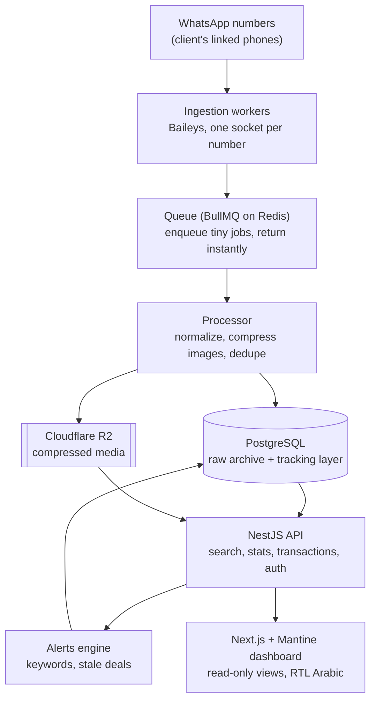
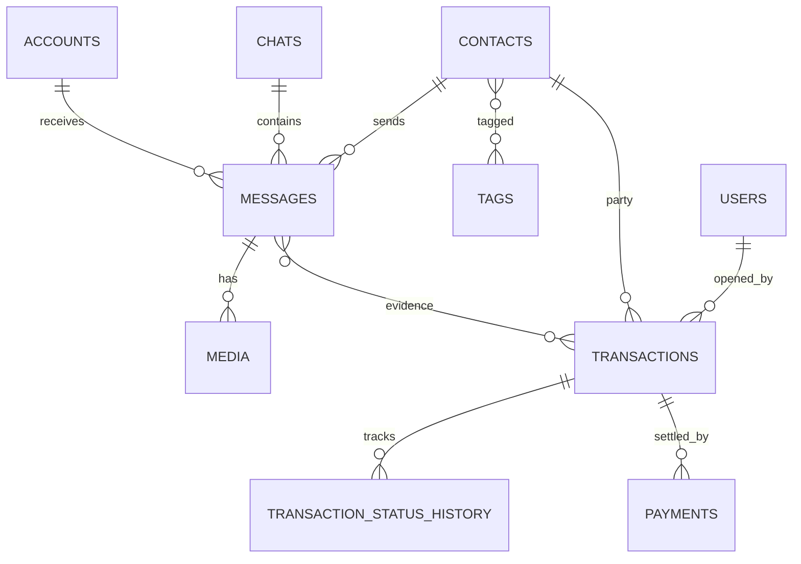
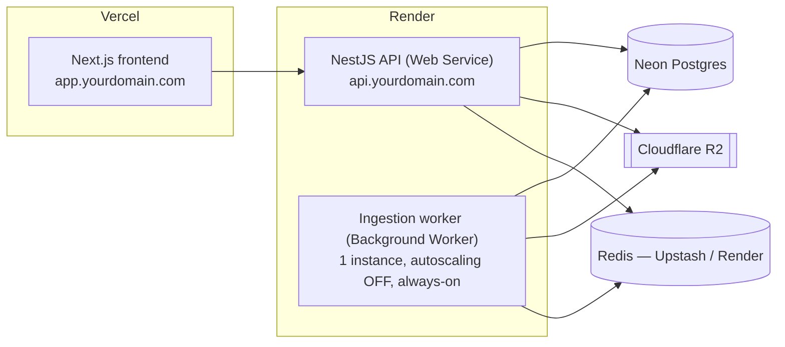

# WhatsApp Supply-Chain Dashboard — System Architecture & Build Plan

> Read-only ingestion of WhatsApp messages across many groups and numbers into a
> structured database, with a human-curated tracking layer for deals, money, and
> status, plus search, statistics, and alerts. Designed to be general enough for
> any shape of the clothing supply chain (factory → agent → marketer → customer)
> and resilient to a number getting banned.

---

## 1. The problem

A trader sits inside a clothing supply chain. The chain runs from factories
through merchants, agents, and marketers, down to end customers. The client's own
role is **not fixed**: sometimes he is the agent handing clothes to a marketer,
sometimes he receives clothes from an agent above him. All coordination happens
over WhatsApp — in roughly 255 groups (and growing), plus one-to-one chats — as a
mix of text, voice notes, and images.

Nothing is currently recorded in a durable, searchable, or trackable way. The goal
is a dashboard that:

1. Connects to one or more of the client's WhatsApp numbers and **reads every
   message** automatically.
2. Stores everything in a database, organized to reflect the chain.
3. Lets a human track deals/shipments through statuses (pending, completed,
   refunded, lost) with amounts of money, and never lets a pending deal be
   forgotten thanks to alerts and reminders.
4. Provides advanced search, sorting, and statistics over the whole history.

---

## 2. Hard constraints & guiding decisions

These shaped every choice below.

- **No official WhatsApp Business API.** It is not realistically available in
  Syria. We connect using a library that links as a **companion device** (the same
  mechanism as WhatsApp Web). The chosen library is **Baileys** (Node.js,
  WebSocket-based, no headless browser needed).
- **This violates WhatsApp's Terms of Service.** A number *can* be banned. The
  entire architecture is therefore built so that **a ban is a recoverable event,
  not a disaster** — all data lives in our own database and object storage,
  independent of WhatsApp.
- **Read-only.** The system only receives and organizes messages. It never sends.
  This is the single biggest factor keeping ban risk low and must be preserved as
  long as possible.
- **Status changes are manual.** The machine cannot reliably decide that a voice
  note means "refund." A human sets deal status; the system's job is to make that
  fast and to *remind* so nothing slips.
- **The chain must be generic.** A contact is not globally "an agent." Roles are
  attributes that can stack and that ultimately depend on the relationship.
- **No product catalog.** A product is free text plus, ideally, the photo that was
  posted. There is no fixed SKU list.

---

## 3. High-level architecture



The flow in words: each linked number runs one persistent Baileys socket. When a
message arrives, the socket handler does almost nothing — it pushes a small job
onto the queue and returns immediately, so a group dumping 40 photos at once never
blocks the connection. A separate processor drains the queue: it normalizes the
message, downloads and **compresses** media (with automatic retries), deduplicates,
and writes to Postgres + R2. The NestJS API serves the dashboard with search,
statistics, and the transaction-tracking logic, and runs the alerts engine. The
Next.js dashboard is the only place humans interact with the data — entirely
read-only against WhatsApp, but read/write against our own tracking tables.

---

## 4. Why a queue, once persistence starts

Earlier the queue was going to be deferred. The group count (255+) changed that.
The danger is not the volume of text — it is media I/O. Downloading an image or
file from WhatsApp and writing it to object storage is slow. Doing that
synchronously inside the Baileys message handler would block the socket's event
loop during bursts, causing dropped messages or an unstable, ban-prone connection.

The queue solves three problems at once:

- **Receive fast.** The handler enqueues a tiny job and returns instantly.
- **Retries.** Media downloads fail intermittently; the queue retries them with
  backoff instead of losing the file.
- **Burst absorption.** Spikes get smoothed out instead of blocking the socket.

Implementation: **BullMQ on Redis**, added when the worker starts persisting raw
messages/media. Phase 0 keeps Docker to Redis only as a placeholder dependency
and connects directly to the remote Neon Postgres database.

---

## 5. The two-layer data model (the foundation)

Everything hangs on separating what the machine records automatically from what a
human curates. These are two different layers with two different owners.

### Raw archive layer — written automatically, append-only, never edited

This is what the ingestion pipeline writes. It is a faithful, immutable record of
exactly what arrived. It does not interpret meaning. A voice note saying "send the
goods back" is, to this layer, just an audio reference — no understanding is added.

### Tracking layer — curated by humans in the dashboard

This is where meaning is added. A **transaction** (a deal/shipment) is a record a
human creates by linking the relevant raw messages to it and setting its status,
amount, and currency. The dashboard's job is to make that linking and searching
fast — pulling related messages next to each other so it is one or two clicks.

> A message becomes a tracked transaction because **a person does it**. The system
> assists with reminders and (optionally, much later) AI suggestions — but the
> manual link is the v1 foundation, and the schema depends on it.

---

## 6. Database schema

PostgreSQL. ORM is **TypeORM** with explicit migrations (never `synchronize: true`
in production — it silently alters tables). Entities are defined once in a shared
package and imported by both the API and the worker.

### 6.1 Raw archive layer

**`accounts`** — the linked WhatsApp numbers (business view of a number).

| column | type | notes |
|---|---|---|
| id | varchar PK | stable human label, e.g. `client-main` |
| label | varchar | display name |
| phone_number | varchar | the number, once known |
| status | varchar | `connected` / `disconnected` / `unknown` |
| last_seen_at | timestamptz | last successful connection |
| media_policy | jsonb | per-type capture policy (see §7) |
| created_at / updated_at | timestamptz | |

> In Phase 0 this exists as a minimal `wa_session` table (id, status,
> last_seen_at). It grows into `accounts` in Phase 2.

**`wa_auth_key`** — Baileys auth state, stored in the DB so a redeploy never drops
the pairing (technical, not business data).

| column | type | notes |
|---|---|---|
| session_id | varchar PK | FK → accounts.id |
| key | varchar PK | `creds` or `<type>-<id>` for signal keys |
| value | text | JSON serialized with Baileys `BufferJSON` |

**`contacts`** — every WhatsApp identity ever observed.

| column | type | notes |
|---|---|---|
| id | uuid PK | |
| wa_jid | varchar unique | WhatsApp identifier |
| phone_number | varchar | |
| push_name | varchar | the name they broadcast |
| is_business | boolean | |
| notes | text | free notes a human can add |
| created_at / updated_at | timestamptz | |

**`chats`** — groups and DMs (keyed globally by WhatsApp JID).

| column | type | notes |
|---|---|---|
| id | uuid PK | |
| wa_jid | varchar unique | |
| type | varchar | `group` / `dm` |
| subject | varchar | group name (nullable for DMs) |
| created_at / updated_at | timestamptz | |

**`account_chats`** — which of our numbers can see a given chat (the same group can
be visible to several linked numbers).

| column | type | notes |
|---|---|---|
| account_id | varchar | FK → accounts.id, PK part |
| chat_id | uuid | FK → chats.id, PK part |

**`chat_participants`** — group membership.

| column | type | notes |
|---|---|---|
| chat_id | uuid | FK → chats.id, PK part |
| contact_id | uuid | FK → contacts.id, PK part |
| role_in_group | varchar | `admin` / `member` |
| joined_at | timestamptz | |

**`messages`** — the heart of the archive.

| column | type | notes |
|---|---|---|
| id | uuid PK | |
| wa_message_id | varchar | WhatsApp's own id |
| account_id | varchar | FK → accounts.id (which number received it) |
| chat_id | uuid | FK → chats.id |
| sender_contact_id | uuid | FK → contacts.id |
| from_me | boolean | |
| timestamp | timestamptz | when WhatsApp says it was sent |
| type | varchar | `text` / `image` / `audio` / `document` / … |
| text | text | body or caption (nullable) |
| quoted_message_id | uuid | self-FK for reply threads (nullable) |
| raw | jsonb | the full original payload — never lose anything |
| created_at | timestamptz | when we stored it |

> **Dedupe:** unique index on `(account_id, wa_message_id)`. Reconnections replay
> messages; this prevents duplicates.

**`media`** — one row per attachment, even when the file itself is skipped.

| column | type | notes |
|---|---|---|
| id | uuid PK | |
| message_id | uuid | FK → messages.id |
| type | varchar | `image` / `video` / `audio` / `document` / `sticker` |
| storage_status | varchar | `stored` / `skipped` / `failed` |
| r2_key | varchar | object key in R2 (nullable when skipped) |
| mime | varchar | |
| size_bytes | bigint | |
| width / height | int | for images |
| caption | text | |
| original_filename | varchar | |
| sha256 | varchar | content hash, for dedupe |
| created_at | timestamptz | |

> Keeping a `media` row even when `storage_status = 'skipped'` means history stays
> honest: the message shows "[image — not stored]" with its caption, instead of a
> silent gap. The capture policy can change later for new messages without rewriting
> the past.

### 6.2 Tracking layer

**`transactions`** — a deal / shipment, curated by a human.

| column | type | notes |
|---|---|---|
| id | uuid PK | |
| from_contact_id | uuid | FK → contacts.id |
| to_contact_id | uuid | FK → contacts.id |
| direction | varchar | `incoming` / `outgoing` (relative to the client) |
| product_text | text | free text — there is no catalog |
| quantity | numeric | |
| amount | numeric | |
| currency | varchar | **`SYP` / `USD` — both supported from day one** |
| status | varchar | `draft` / `pending` / `in_transit` / `completed` / `refunded` / `lost` / `cancelled` |
| opened_by_user_id | uuid | FK → users.id |
| opened_at / closed_at | timestamptz | |
| notes | text | |
| created_at / updated_at | timestamptz | |

**`transaction_messages`** — links raw messages as evidence for a deal (the bridge
between the two layers).

| column | type | notes |
|---|---|---|
| transaction_id | uuid | FK, PK part |
| message_id | uuid | FK, PK part |

**`transaction_status_history`** — audit trail of every status change. Essential
when money is involved.

| column | type | notes |
|---|---|---|
| id | uuid PK | |
| transaction_id | uuid | FK |
| from_status / to_status | varchar | |
| changed_by_user_id | uuid | FK → users.id |
| note | text | |
| changed_at | timestamptz | |

**`payments`** — partial payments happen, so they are first-class.

| column | type | notes |
|---|---|---|
| id | uuid PK | |
| transaction_id | uuid | FK |
| amount | numeric | |
| currency | varchar | `SYP` / `USD` |
| direction | varchar | `in` / `out` |
| method | varchar | |
| paid_at | timestamptz | |
| note | text | |

### 6.3 Roles, system & alerts

**`tags`** — shared mechanism for both roles and custom labels.

| column | type | notes |
|---|---|---|
| id | uuid PK | |
| name | varchar | e.g. `factory`, `agent`, `marketer` |
| kind | varchar | `role` / `custom` |
| color | varchar | |

**`contact_tags`** — a contact can carry several role tags at once
(factory / merchant / agent / marketer / customer). This is the v1 model.
Per-relationship roles (who someone is *to a specific other party*) are a Phase-2
refinement.

| column | type | notes |
|---|---|---|
| contact_id | uuid | FK, PK part |
| tag_id | uuid | FK, PK part |

**`users`** — dashboard logins.

| column | type | notes |
|---|---|---|
| id | uuid PK | |
| email | varchar unique | |
| password_hash | varchar | scrypt + per-row random salt |
| name | varchar | |
| role | varchar | `admin` / `staff` |
| is_active | boolean | |
| created_at | timestamptz | |

**`refresh_tokens`** — rotating server-tracked refresh sessions (DB-backed).

| column | type | notes |
|---|---|---|
| id | uuid PK | JTI from the refresh JWT |
| user_id | uuid | FK → users.id |
| token_hash | text | SHA-256 hash of raw refresh token |
| csrf_hash | text | SHA-256 hash of issued CSRF token |
| expires_at | timestamptz | |
| ip_address_hash | text | SHA-256 hash of last IP (best-effort) |
| user_agent | text | |
| revoked_at | timestamptz | NULL while active |
| created_at / updated_at | timestamptz | |

**`alert_rules`** — configurable triggers.

| column | type | notes |
|---|---|---|
| id | uuid PK | |
| name | varchar | |
| type | varchar | `keyword` / `stale_transaction` / `no_movement` |
| config | jsonb | e.g. `{ "keywords": ["مرتجع","refund"] }` or `{ "days": 7 }` |
| is_active | boolean | |
| created_by_user_id | uuid | FK |
| created_at | timestamptz | |

**`notifications`** — generated alerts shown in the dashboard.

| column | type | notes |
|---|---|---|
| id | uuid PK | |
| alert_rule_id | uuid | FK (nullable) |
| title / body | text | |
| severity | varchar | `info` / `warning` / `critical` |
| related_transaction_id | uuid | FK (nullable) |
| related_message_id | uuid | FK (nullable) |
| is_read | boolean | |
| created_at | timestamptz | |

**`audit_log`** — who changed what, for accountability.

| column | type | notes |
|---|---|---|
| id | uuid PK | |
| user_id | uuid | FK |
| action | varchar | |
| entity_type / entity_id | varchar | |
| before / after | jsonb | |
| created_at | timestamptz | |

### 6.4 Core relationships



---

## 7. Media handling policy

Two facts drive this:

1. **Downloading media does NOT increase ban risk.** WhatsApp cannot see what a
   linked device does after a message arrives. Media handling is a *cost* decision,
   not a *safety* decision.
2. Storage across 255+ active groups adds up fast, so we are deliberate about it.

The policy is **per-type and configurable per account** (the `media_policy` JSONB
on `accounts`):

| type | policy | reasoning |
|---|---|---|
| **image** | **compress** → WebP, ~1280px max, ~80% quality | The photo is often the *real* record of the product (text is vague: "the blue ones"). A 4MB photo becomes 80–150KB — a 95%+ reduction. Keep it. |
| **audio (voice)** | **skip** | Per current decision, voice notes are not handled. Metadata row is still written (see below). |
| **video** | **skip** | Heaviest type; rarely the deal record. |
| **document** | **skip** | Configurable; enable per account if needed. |

Default policy object:

```json
{ "image": "compress", "audio": "skip", "video": "skip", "document": "skip" }
```

**Always write the metadata row**, even when the file is skipped: type, caption,
size, original filename, timestamp, with `storage_status = 'skipped'`. This keeps
the message history complete and lets the policy change later for new messages
without losing the past.

---

## 8. Authentication

For this repository version, authentication is hard-coded in the API with:

- Email/password login on `/api/auth/login`.
- JWT access tokens in an `HttpOnly`, `Secure`, `SameSite=Strict` cookie (short-lived).
- Database-backed rotating refresh tokens (`refresh_tokens` table): hash-only storage,
  expiry, revoke-on-rotation, and CSRF-bound refresh endpoint.
- Role checks on every protected API route for `admin` / `staff`.
- Refresh flow uses `X-CSRF-Token` header with the non-`HttpOnly` CSRF cookie value.
- Audit events for mutating actions in `audit_log`.

Alternatives still considered for future refactors: `@nestjs/passport`,
Auth.js/NextAuth, or hosted IdPs (not used in phase 5).

---

## 9. Tech stack summary

| concern | choice | rationale |
|---|---|---|
| Language | TypeScript end-to-end | Baileys is Node; one language, no context switching |
| Ingestion worker & API | NestJS | Forces good structure (modules, services, DI) |
| ORM | TypeORM + migrations | Idiomatic with Nest; never `synchronize` in prod |
| Database | Neon Postgres | Managed PG; budget for near-24/7 compute (ingestion rarely idles) |
| Queue | BullMQ on Redis | Receive-fast, retries, burst absorption once raw persistence/media begins |
| Media storage | Cloudflare R2 | S3-compatible, cheap, **zero egress fees** (dashboard reloads media constantly) |
| Auth | JWT access + rotating refresh tokens + role checks | Minimal dependencies, audit-ready |
| Frontend | Next.js + Mantine | Mantine `DirectionProvider` = `rtl` for Arabic |
| Tables UI | `mantine-react-table` | Sortable/filterable message & transaction tables |
| Data fetching | TanStack Query | |
| Live updates | Socket.IO or SSE | New messages appear without refresh |
| Search (v1) | Postgres full-text (Arabic config) | Good enough to start |
| Search (later) | Meilisearch | Better Arabic + typo tolerance once search is the star |

---

## 10. Deployment topology



- **Vercel** hosts the Next.js frontend.
- **Render** hosts two services from the same monorepo:
  - The **ingestion worker** as a **Background Worker**, locked to **exactly one
    instance, autoscaling off**. Two instances on the same number = duplicate
    sessions = ban.
  - The **NestJS API** as a separate **Web Service**.
  - Both must be **paid, always-on**. Render's free tier spins services down when
    idle, which would kill the WhatsApp connection.
- **Neon** for the database (pooled connection string for the serverless side, a
  small direct pool for the worker).
- **Cloudflare R2** for media.
- **Redis** on Upstash or Render managed.

### Deployment traps that must be handled

1. **Store the Baileys session in Postgres, not on disk.** Render's filesystem is
   ephemeral and wipes on every redeploy; file-based auth state means re-scanning
   the QR constantly. (Done in Phase 0 via the `wa_auth_key` table.)
2. **Single root domain for cookies.** Frontend on `app.yourdomain.com`, API on
   `api.yourdomain.com`. Different bare domains break the `SameSite` auth cookie.
3. **Never `synchronize: true`.** Use migrations from the first commit.
4. **One worker instance per number.** Enforced by Render config.

---

## 11. Staying un-banned (priority requirement)

A banned number loses access, not data — but it is still costly, so every lever is
pulled:

- **Read-only.** The biggest lever. The moment the system can *send*, the risk
  profile changes completely. Preserve read-only as long as possible.
- **Use aged, established numbers.** Never a freshly bought SIM — new numbers are
  flagged fastest.
- **Keep the real WhatsApp app alive on the primary phone.** The library connects
  as a companion device; the primary phone should look normal and be used by a
  human occasionally.
- **One session per number, one worker instance.** Two sessions fighting is a
  classic trigger.
- **Reconnect with backoff, not a tight loop.** Hammering reconnections looks
  bot-like. (Implemented: exponential backoff capped at 60s.)
- **Keep Baileys updated.** An outdated client protocol is itself a signal.
- **Do not auto-join or auto-leave groups.** Let the human do that on the phone.
- **Design for recoverability.** All data lives in Postgres + R2, independent of
  WhatsApp. If a number is banned, re-link a different one; the entire history —
  every transaction, every record — is untouched. **Assume a ban will eventually
  happen to *some* number and make it a non-event.**

---

## 12. Build plan (phased)

The system is built in order; each phase is independently useful.

### Phase 0 — Connectivity (DONE)
One number links via QR. The Baileys session is stored in Postgres (survives
redeploys). Messages log to the console. The connection reconnects with backoff.
It uses a remote Neon direct Postgres connection; Docker only runs Redis for the
later queue layer. **Proof tests:** restart the worker → reconnects with no new
QR; toggle the network → backoff messages then `connected`.

*Delivered: monorepo (`packages/entities`, `apps/worker`), `wa_session` +
`wa_auth_key` tables, Postgres-backed Baileys auth state, connection manager with
backoff.*

### Phase 1 — Persist the raw layer (DONE)
Write `contacts`, `chats`, `chat_participants`, `messages`, `media` (metadata).
Stand up the NestJS API. Basic dashboard list + Postgres full-text search. This
alone is already useful.

*Delivered so far: raw archive entities + migration, live message persistence,
dedupe on `(account_id, wa_message_id)`, contact/chat normalization, skipped
media metadata rows, a thin archive API, dashboard list, chat filtering, and
Postgres full-text search. The Phase 1 API is intentionally dependency-light;
the planned NestJS API can replace or absorb it when auth/users/roles arrive.*

### Phase 2 — Scale & media pipeline
Multiple numbers, robust reconnection, BullMQ queue, R2 media pipeline with image
compression, live updates via Socket.IO/SSE. Grow `wa_session` into `accounts`
with `media_policy`.

### Phase 3 — Tracking layer
`transactions`, `transaction_messages`, `transaction_status_history`, `payments`,
`tags`, `contact_tags`. The dashboard flow for linking messages to deals and
changing status (with full history). SYP + USD throughout.

### Phase 4 — Search, stats & alerts
Move search to Meilisearch (better Arabic + typos). Statistics dashboards. The
`alert_rules` engine: keyword alerts (e.g. "مرتجع"), stale-pending reminders,
no-movement nudges, feeding `notifications`.

### Phase 5 — Harden (completed)
Completed with:

- `users` + `audit_log` migration and API exposure.
- Role-based access for dashboard writes and read paths.
- JWT-based session auth (access/refresh cookies), login-rate limiting, and CSRF-protected
  refresh.
- Backup automation for `DATABASE_URL` via `scripts/backup-postgres.ps1` and
  `pnpm backup:postgres`.

Remaining optional stretch:

- Per-relationship role modeling.

---

## 13. Open items

- **Launch number count** — one number (with the 255 groups) or several from day
  one. Decides whether the worker holds one Baileys socket or several, which sets
  the worker's memory sizing.
- **Team vs. single user** — affects how much of the `users`/roles work moves
  earlier.
- **Future AI assist (optional, post-v1)** — suggesting "these messages look like a
  new deal of ~50 pieces" to speed up manual linking. Explicitly not part of the
  foundation.

---

*This document is the canonical reference for the project. Update it as decisions
change — especially the schema and the media policy.*
